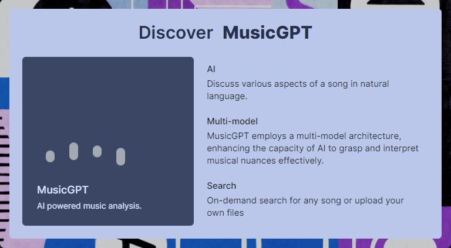
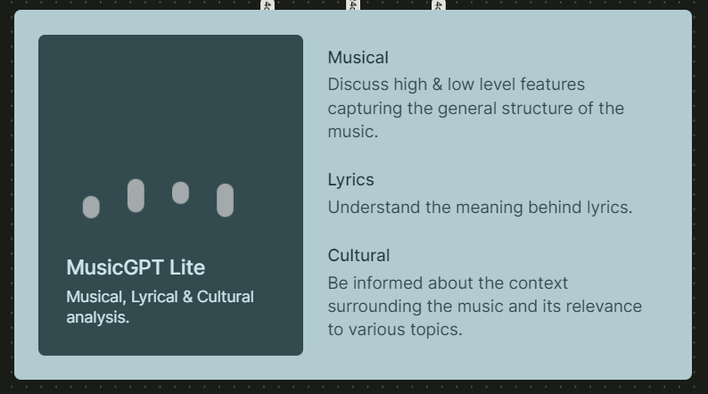
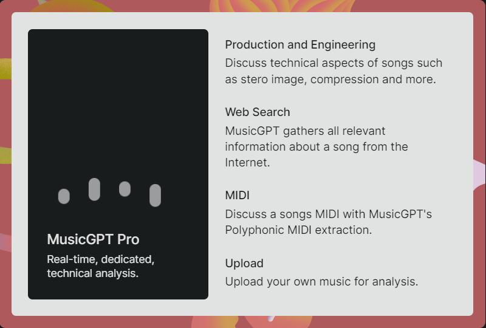

<p align="center">
  <a href="https://music-gpt.xyz">
    <picture>
      
    </picture>
    <h1 align="center">MusicGPT</h1>
  </a>
</p>

<p align="center">
  <a aria-label="MusicGPT" href="https://music-gpt.xyz">
    
  </a>
  <a aria-label="License">
    
  </a>
</p>

## What is MusicGPT?

Explore, understand, and discuss music like never before with mutimodal AI

## MusicGPT Lite

General musical, lyrical & cultural analysis

<p align="left">
  <a href="https://music-gpt.xyz/lite">
    <picture>
      
    </picture>
  </a>
</p>

## MusicGPT Pro

Real-time, dedicated, technical analysis

<p align="left">
  <a href="https://music-gpt.xyz/pro">
    <picture>
      
    </picture>
  </a>
</p>

## Getting Started

These instructions will help you get a copy of the project up and running on your local machine for development and testing purposes.

### Prerequisites

Before you begin, ensure you have the following installed on your machine:

- Node.js: [Download and Install Node.js](https://nodejs.org/)
- npm (Node Package Manager): Comes with Node.js installation.

### Installing

1. Clone the repository to your local machine.

   ```bash
   git clone https://github.com/caleb-sideras/MusicGPT.git
   ```

2. Navigate to the project's directory.

   ```bash
   cd MusicGPT
   ```

3. Install the project dependencies.

   ```bash
   npm install
   ```

### Running the Application

To run the application for development, use the following commands:

1. Build and run Javascript

   ```bash
   npm run dev
   ```

## License
This project is licensed under the MIT License.